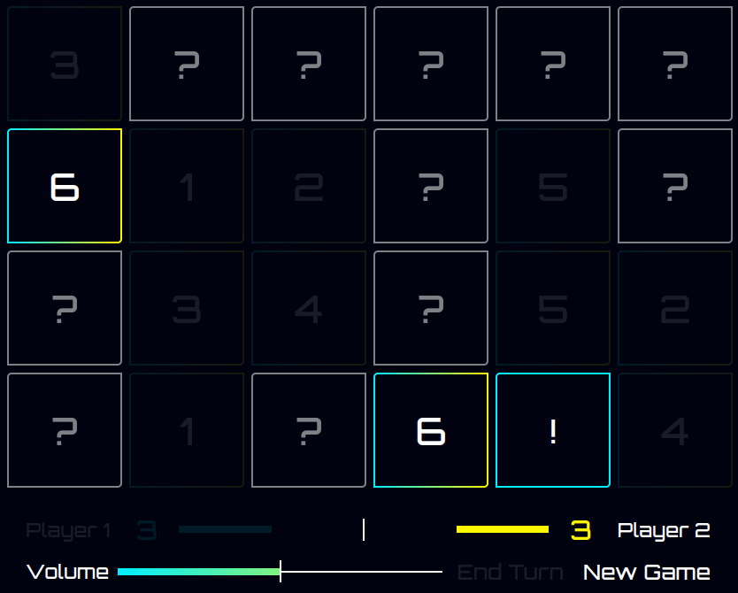
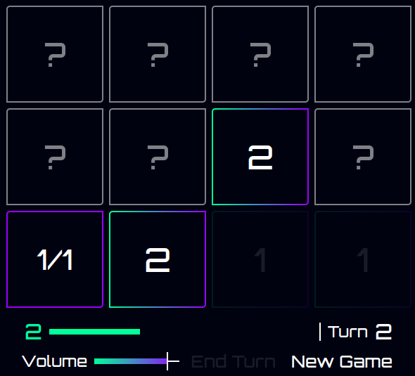
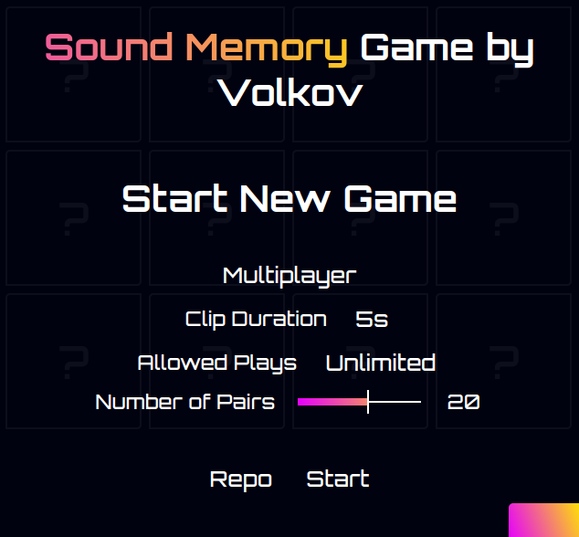

# Sound Memory

A game of Memory, but with sound clips!

## How to play

Each card plays a sound when you click it, 2 cards for each unique sound.
Alternate turns uncovering 2 cards and try to remember their content. Find a pair of matching sounds and get a point, and a chance to uncover 2 more. Matched Pairs will also show their corresponding number once found.

You can also switch to singleplayer and try to find all pairs in the lowest number of turns.

## Game Options

When starting a game, you can customize different options:

### Singleplayer / Multiplayer

Simple toggle between the multiplayer (two scores) and singleplayer modes (one score & turn counter)

### Clip Duration

By default, the sound clips you play with, are 5 seconds long. If you want to make it harder, you can change it to 0.5s 1s, or 3s, and the clips will be faded out correspondingly. There may be minor artifacts, as this fading is done client-side

### Allowed Plays

By default, you can play an uncovered card as many times as you like, until you end your turn. You can make it harder by allowing each uncovered card to be played only 1, 2 or 3 times in a single turn.

### Number of Pairs

The number of sound clips that you play with, may be between 4 and 32. The number of cards will be twice that.

## Audio

All ~100 songs/sound effects used are sourced from the free [Youtube Audio Library](https://www.youtube.com/audiolibrary). The original files are not included in the repository, but the files processed by `process.py` and used in-game can be found in the `sounds/` directory. These files are automatically cut to 5s, made to contain the loudest part of the audio, normalized and faded in & out.
